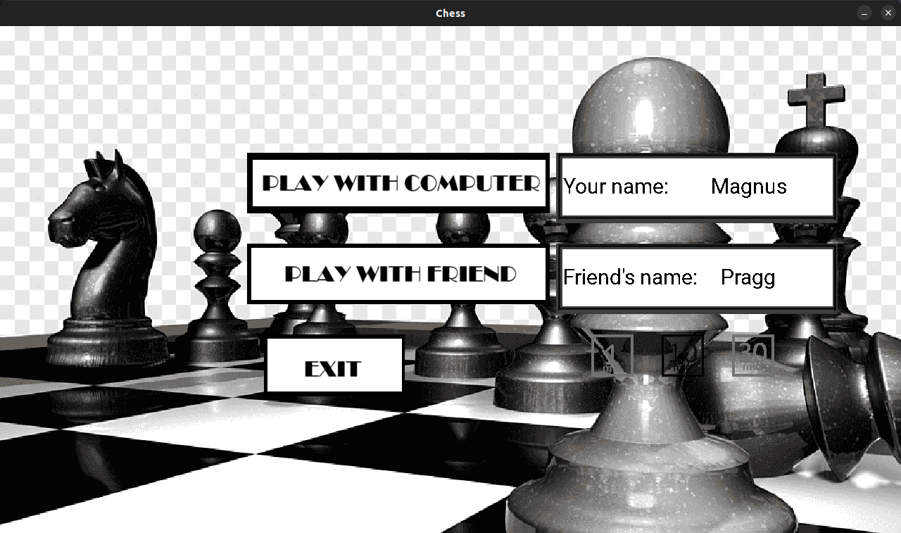
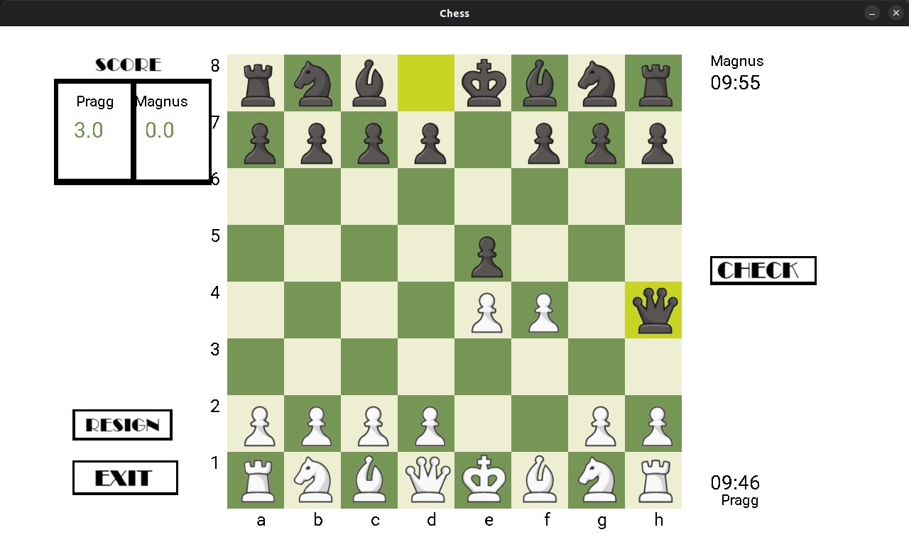
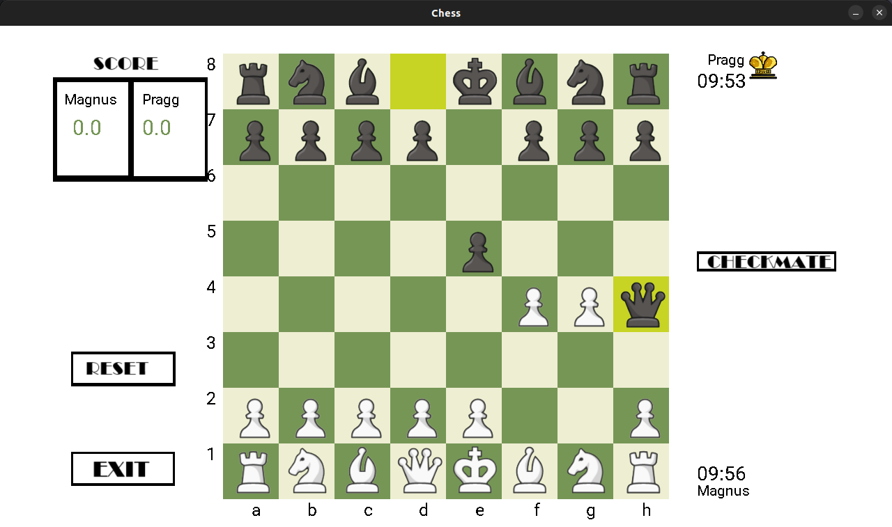
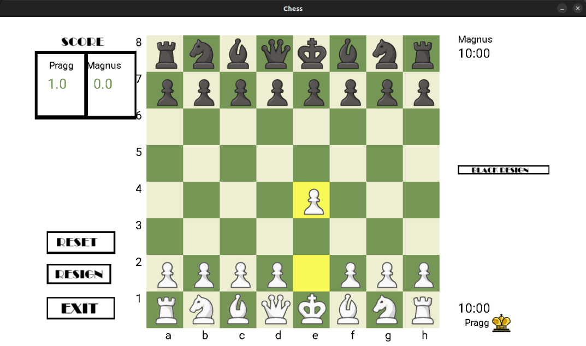
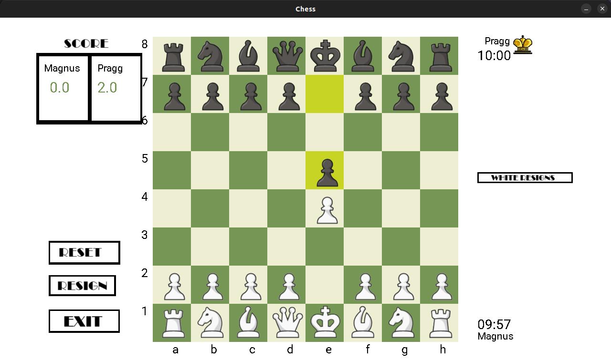
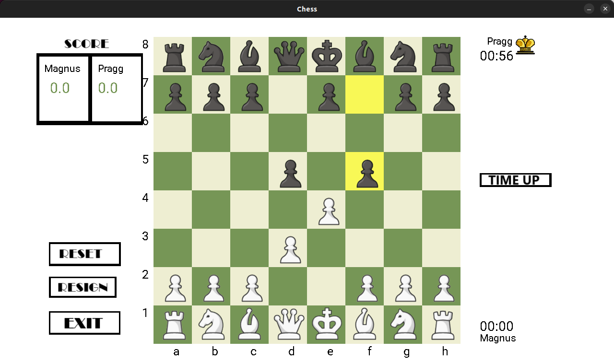

## Dependencies
* SDL2
* SDL2_image, SDL2_mixer, SDL2_ttf

## How to use this? 🛠
Click on the link below for set up and usage instructions!

<a href = "https://github.com/poudelsaroj/chess/blob/main/Chess/installation.md">click on this</a>

## Screenshots

<table>
  <tr>
    <td>Menu</td>
     <td>Check</td>
     <td>Checkmate</td>
  </tr>
  <tr>
    <td></td>
    <td></td>
    <td></td>
  </tr>
  <tr>
    <td>Black resigns</td>
     <td>White resigns</td>
     <td>Time up</td>
  </tr>
  <tr>
    <td></td>
    <td></td>
    <td></td>
  </tr>
 </table>

## Developers
1. Saroj Poudel
2. Spandan Bhandari
3. Subash Kandel
